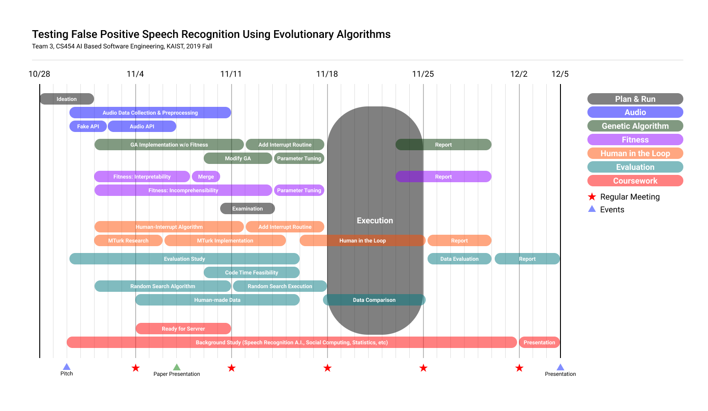

# CS454 AI Based Software Engineering
Repository for Group Project of CS454, KAIST, 2019 Fall

## About the Course

> Please refer to the [Course Homepage](https://coinse.kaist.ac.kr/teaching/2019/cs454/)

This class covers metaheuristic optimisation algorithms and their application to software engineering problems. The goal of the class is twofold: the first objective is to understand major classes of metaheuristic algorithms, including local search algorithms and population based optimisation (such as genetic algorithm and particle swarm optimisation). The second objective is to study the application of these algorithms to software engineering problems. For this, the class will introduce the fundamental concepts in so called Search Based Software Engineering, and then study various application cases across the software development lifecycle (requirements, design, planning, testing, maintenance, etc). The desired learning outcome is to be able to use metaheuristic optimisation to automate, and/or gain insights into, software engineering tasks.

The first half of the course will be a series of lectures on metaheuristic algoithms. The second half will be a series of case studies based on paper presentations, given by students, about important and/or recent papers in the field of Search Based Software Engineering.

### About the Group Project
> Please refer to the [document](https://coinse.kaist.ac.kr/assets/files/teaching/2019/cs454/cs454-project-2019.pdf). 

The course project requires you to identify and formulate an SBSE problem and solve it using a metaheuristic approach. 

## About the Project

>  **Testing False Positive Speech Recognition Using Evolutionary Algorithms**

### Roadmap and Responsibility



* Plan & Run: **People to whom it may concern**
* Audio: Juan(C++), **Sungwoo(C)**
* Genetic Algorithm: **Kihoon**
* Fitness: **Sungwoo(Incomprehensibility)**, Taehyeon, Juan(Interpretability)
* Human in the Loop: **Taehyeon**, **Hyunchang**
* Plan B: **Taehyeon**
* Evaluation: **Hyunchang**, Kihoon
* Coursework: **Everyone**
* AI Study: Kihoon, Juan, Sungwoo

### Reports
* [Pitch Presentation](https://docs.google.com/presentation/d/1nxoFEuv6dOUZKpGBUdsLgrT2VprfhpCsEu3w-fz0nt8/edit#slide=id.g656785dafc_4_1)
* Final Presentation
* Report
* Demo

### Documents

* [Coding Style Agreement](https://sleepy-juan.github.io/false-positive-speech-data/StyleGuide.html)
* [Wav Format Handler Document](https://sleepy-juan.github.io/false-positive-speech-data/WavDoc.html)

### Collaborator
> Sorted by Korean alphabetical order
* [Kihoon Kwon](https://github.com/KwonKyoon)
* [Taehyeon An](https://github.com/An-T-Hyeon)
* [Hyunchang Oh](https://github.com/HyunchangOh)
* [Juan Lee](https://github.com/sleepy-juan)
* [Sungwoo Jeon](https://github.com/marunero)

## About the Code

The project used many third-party libraries, multiple programming languages, and/or co-working process with diverse code hierarchy. Please thoroughly follow below instructions to run the code in your environment.

### Run and Test Google API

Since Google Speech API does not support C++, we made a python program and export the result through the pipe. 

1. Enable **Google Speech To Text API** at [Google Cloud Platform Console](https://console.cloud.google.com/)
2. Make and Download **Your Private Key**, we named it `google_api_key.json`
3. Export your private key for the current session.

```bash
$ export GOOGLE_APPLICATION_CREDENTIALS="/path/to/google_api_key.json"
```

4. Install **Python Google Speech Module**

```bash
$ pip install --upgrade google-cloud-speech
```

5. Run the code with your audio file (arguments: *filename*and *sample rate*)

```bash
$ python3 google_api_python.py "path/to/audio_file.wav" 48000
```

